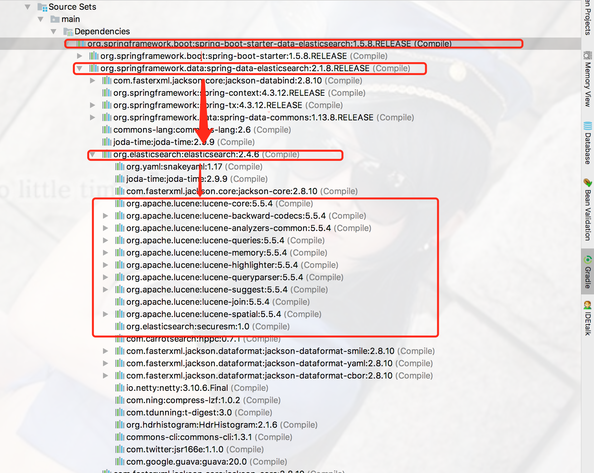
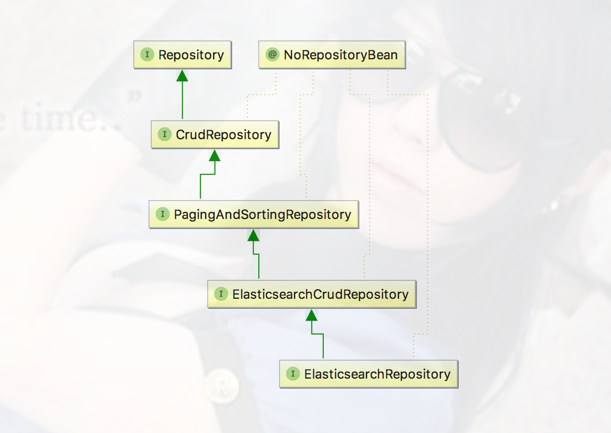
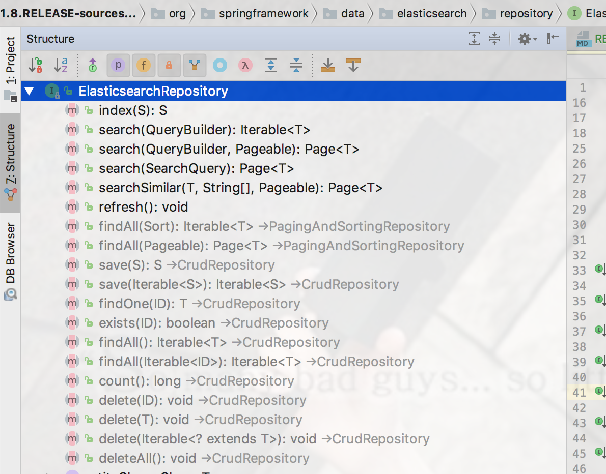

完整代码示例，请参考个人GitHub仓库:[kingboy-springboot-es](https://github.com/KingBoyWorld/kingboy-springboot-es.git),
包含controller/repository以及测试代码。

欢迎star，如有错误，欢迎指正^_^

### 一、环境简介

- idea 2016.3
- jdk 1.8
- ElasticSearch 2.4(之所以不用最新的，是因为SpringBoot和ES的版本是需要相匹配的，而SpringBoot Starter目前不支持最新版)

### 二、ES简介

开发过Java搜索的同学一定都知道lucene搜索引擎，但是lucene只是一个搜索引擎，就好比一个汽车的发动机，重要但是却无法直接使用。
后来就有了为大家所知的solr搜索，提供了对应的web操作界面和java api操作，但是solr的数据并发量和大数据量下的表现相比后来者ES
都还是有一定差距的，而且ES是天生支持分布式集群的。

ES是什么？我们可以把ES比作一个Mysql数据库，同样用来存储数据，不过比Mysql提供了更多的搜索功能,例如分词搜索，关联度搜索等，而且搜索速度也不是同一级别的，
ES能够实现百万数据/秒的查询速度。接下来将ES中用到的概念和Mysql进行类比。

> index 
>> 索引，相当于Mysql中的一个库，例如有一个叫『jd』的库，那么里面可以建立很多表，存储不同类型的数据，而表在ES中就是type。

> type  
>> 类型，相当于Mysql中的一张表，存储json类型的数据

> document
>> 文档，一个文档相当于Mysql一行的数据

> field 
>> 列，相当于mysql中的列，也就是一个属性

> shards
>>分片，通俗理解，就是数据分成几块区域来存储，可以理解为mysql中的分库分表(不太恰当)

> replicas
>> 备份，就是分片的备份数,相当于mysql的备份库

ES使用json数据进行数据传递，例如{username:king,age:12},那么这一整条json数据就是一个document，而username,age就是field。

### 三、SpringBoot集成ES的依赖

```gradle
//ES的核心依赖Starter
compile('org.springframework.boot:spring-boot-starter-data-elasticsearch')
//jna依赖，否则项目启动时，会报classNotFound: native method disable的错误
compile("com.sun.jna:jna:3.0.9")
//添加web支持，方便测试
compile('org.springframework.boot:spring-boot-starter-web')
testCompile('org.springframework.boot:spring-boot-starter-test')
```

### 四、配置文件

> 配置文件是可以配置也可以不配置的，data-elasticsearch的依赖结构中已经包含了Lucene和ES的jar，SpringBoot会自动在本地给我们生成一个ES的仓库，项目下会自动产生一个data文件夹存储ES的数据。如果我们不配置ES实例，
那么SpringBoot就会自动生成这个ES实例,当然性能肯定是不行的，所以我们还是使用自己搭建的ES实例。

> data-elasticsearch的依赖结构

>>>> 


连接独立的ES实例的配置如下

```
spring:
  data:
    #ElasticSearch的连接地址
    elasticsearch:
      cluster-name: elasticsearch
      cluster-nodes: localhost:9300
```

> 关于ES的安装可以参考我的另一篇博文[CentOS6.5安装ES教程](http://blog.csdn.net/kingboyworld/article/details/77814528)


### 五、编写存储实体类

编写实体类主要会用到如下三个注解

#### 1.类上注解：@Document  (相当于Hibernate实体的@Entity/@Table)

(必写)

|类型|属性名|默认值|说明|
|--|--|--|--|
|String| indexName|无|索引库的名称，建议以项目的名称命名|
|String| type|""|类型，建议以实体的名称命名|
|short |shards|5|默认分区数|
|short |replica|1|每个分区默认的备份数|
|String| refreshInterval|"1s"|刷新间隔|
|String| indexStoreType|"fs"|索引文件存储类型|

#### 2.主键注解：@Id (相当于Hibernate实体的主键@Id注解)

(必写)

只是一个标识，并没有属性。

#### 3.属性注解 @Field (相当于Hibernate实体的@Column注解)

@Field默认是可以不加的，默认所有属性都会添加到ES中。

|类型|属性名|默认值|说明|
|--|--|--|--|
|FieldType|type|FieldType.Auto|自动检测属性的类型|
|FieldIndex|index|FieldIndex.analyzed|默认情况下分词|
|boolean|store|false|默认情况下不存储原文|
|String|searchAnalyzer|""|指定字段搜索时使用的分词器|
|String|indexAnalyzer|""|指定字段建立索引时指定的分词器|
|String[]|ignoreFields|{}|如果某个字段需要被忽略|


#### 4.实体类示例

```java
@Data  //lombok注解，会自动生成setter/getter,需要引入lombok的包才能使用。
@Document(indexName = "shop", type = "user", refreshInterval = "0s")
public class User {

    @Id
    private Long id;

    private String username;

    private String realname;

    private String password;

    private Integer age;

    //这三个注解是为了前台序列化java8 LocalDateTime使用的，需要引入jsr310的包才可以使用
    @JsonSerialize(using = LocalDateTimeSerializer.class)
    @JsonDeserialize(using = LocalDateTimeDeserializer.class)
    @JsonFormat(pattern = "yyyy-MM-dd HH:mm")
    private LocalDateTime birth;

}

```

### 六、编写仓库

#### 1.代码编写
写一个类继承ElasticsearchRepository<T, ID>，需要写两个泛型，第一个代表要存储的实体类型，第二个代表主键类型，例如写一个User类的仓储如下：

```java
/**
 * @author kingboy--KingBoyWorld@163.com
 * @date 2017/11/27 下午10:10
 * @desc 用户仓库.
 */
public interface UserRepository extends ElasticsearchRepository<User, Long>{

}

```

我们来看一下ElasticsearchRepository的继承结构(如下)，其实就可以发现仍然是JPA的一套Reposiroty，那我们其实就可以用JPA的一套接口操作进行数据的增删改查，
spring会自动根据方法名为我们生成对应的代理类去实现这些方法。

>>>> 


#### 2.CRUD基础操作

先来看看ElasticsearchRepository已经实现的一些基础方法，这些方法的名称已经具有很好的说明解释了，那么大家自己看看，很容易就能理解

>>>> 


#### 3.稍微复杂操作

jpa自带的这些方法肯定是不能满足我们的业务需求的，那么我们如何自定义方法呢？我们只要使用特定的单词对方法名进行定义，那么Spring就会对我们写的方法名进行解析，
生成对应的实例进行数据处理，有木有很简单？那么接下来就使用Spring官方文档中的实例进行演示。

先来看下关键字的说明

|关键字             |使用示例                 |等同于的ES查询               |
|------------------|------------------------|---------------------------|
|And               |findByNameAndPrice      |{"bool" : {"must" : [ {"field" : {"name" : "?"}}, {"field" : {"price" : "?"}} ]}}|
|Or                |findByNameOrPrice       |{"bool" : {"should" : [ {"field" : {"name" : "?"}}, {"field" : {"price" : "?"}} ]}}|
|Is                |findByName              |{"bool" : {"must" : {"field" : {"name" : "?"}}}}|
|Not               |findByNameNot           |{"bool" : {"must_not" : {"field" : {"name" : "?"}}}}|
|Between           |findByPriceBetween      |{"bool" : {"must" : {"range" : {"price" : {"from" : ?,"to" : ?,"include_lower" : true,"include_upper" : true}}}}}|
|LessThanEqual     |findByPriceLessThan     |{"bool" : {"must" : {"range" : {"price" : {"from" : null,"to" : ?,"include_lower" : true,"include_upper" : true}}}}}|
|GreaterThanEqual  |findByPriceGreaterThan  |{"bool" : {"must" : {"range" : {"price" : {"from" : ?,"to" : null,"include_lower" : true,"include_upper" : true}}}}}|
|Before            |findByPriceBefore       |{"bool" : {"must" : {"range" : {"price" : {"from" : null,"to" : ?,"include_lower" : true,"include_upper" : true}}}}}|
|After             |findByPriceAfter        |{"bool" : {"must" : {"range" : {"price" : {"from" : ?,"to" : null,"include_lower" : true,"include_upper" : true}}}}}|
|Like              |findByNameLike          |{"bool" : {"must" : {"field" : {"name" : {"query" : "? *","analyze_wildcard" : true}}}}}|
|StartingWith      |findByNameStartingWith  |{"bool" : {"must" : {"field" : {"name" : {"query" : "? *","analyze_wildcard" : true}}}}}|
|EndingWith        |findByNameEndingWith    |{"bool" : {"must" : {"field" : {"name" : {"query" : "*?","analyze_wildcard" : true}}}}}|
|Contains/Containing|findByNameContaining    | {"bool" : {"must" : {"field" : {"name" : {"query" : "?","analyze_wildcard" : true}}}}}|
|In                 |findByNameIn(Collection<String>names)|{"bool" : {"must" : {"bool" : {"should" : [ {"field" : {"name" : "?"}}, {"field" : {"name" : "?"}} ]}}}}|
|NotIn              |findByNameNotIn(Collection<String>names) |{"bool" : {"must_not" : {"bool" : {"should" : {"field" : {"name" : "?"}}}}}}|
|True               |findByAvailableTrue       |{"bool" : {"must" : {"field" : {"available" : true}}}}|
|False              |findByAvailableFalse      |{"bool" : {"must" : {"field" : {"available" : false}}}}|
|OrderBy            |findByAvailableTrueOrderByNameDesc  |{"sort" : [{ "name" : {"order" : "desc"} }],"bool" : {"must" : {"field" : {"available" : true}}}}|


下面写几个示例进行演示，只把仓储层的列出来了，整体运行是测试过的，没问题，如果需要整体代码请到本文顶部的github仓库查看。

```java
/**
 * @author kingboy--KingBoyWorld@163.com
 * @date 2017/11/27 下午10:10
 * @desc 用户仓库.
 */
public interface UserRepository extends ElasticsearchRepository<User, Long>{

    /**
     * 查询用户名为username的用户
     * @param username
     * @return
     */
    List<User> findByUsername(String username);

    /**
     * 查询用户名为username并且真实姓名为realname的用户
     * @param username
     * @param realname
     */
    List<User> findByUsernameAndRealname(String username, String realname);

    /**
     * 查询用户名为username或者姓名为realname的用户
     */
    List<User> findByUsernameOrRealname(String username, String realname);

    /**
     * 查询用户名不是username的所有用户
     * @param username
     * @return
     */
    List<User> findByUsernameNot(String username);


    /**
     * 查询年龄段为ageFrom到ageTo的用户
     * @param ageFrom
     * @param ageTo
     * @return
     */
    List<User> findByAgeBetween(Integer ageFrom, Integer ageTo);

    /**
     * 查询生日小于birthTo的用户
     */
    List<User> findByBirthLessThan(LocalDateTime birthTo);


    /**
     * 查询生日段大于birthFrom的用户
     * @param birthFrom
     * @return
     */
    List<User> findByBirthGreaterThan(LocalDateTime birthFrom);

    /**
     * 查询年龄小于或等于ageTo的用户
     */
    List<User> findByAgeBefore(Integer ageTo);

    /**
     * 查询年龄大于或等于ageFrom的用户
     * @param ageFrom
     * @return
     */
    List<User> findByAgeAfter(Integer ageFrom);

    /**
     * 用户名模糊查询
     * @param username
     * @return
     */
    List<User> findByUsernameLike(String username);


    /**
     * 查询以start开头的用户
     * @param start
     * @return
     */
    List<User> findByUsernameStartingWith(String start);

    /**
     * 查询以end结尾的用户
     * @return
     */
    List<User> findByUsernameEndingWith(String end);

    /**
     * 查询用户名包含word的用户
     * @param word
     * @return
     */
    List<User> findByUsernameContaining(String word);

    /**
     * 查询名字属于usernames中的用户
     * @param usernames
     * @return
     */
    List<User> findByUsernameIn(Collection<String> usernames);

    /**
     * 查询名字不属于usernames中的用户
     * @param usernames
     * @return
     */
    List<User> findByUsernameNotIn(Collection<String> usernames);

    /**
     *最后来个复杂点的：查询年龄小于ageTo,姓名以start开头，id大于idTo的用户，并且按照年龄倒序
     * @return
     */
    List<User> findByAgeBeforeAndUsernameStartingWithAndIdGreaterThanOrderByAgeDesc(Integer ageTo, String start, Long idTo);

}

```


#### 4.更复杂一点的操作

我们可以使用@Query注解进行查询，这样要求我们需要自己写ES的查询语句，需要会ES查询才可以，其实也很简单，不会写查就是了。

看看官方给的例子
```java
public interface BookRepository extends ElasticsearchRepository<Book, String> {
        @Query("{\"bool\" : {\"must\" : {\"field\" : {\"name\" : \"?0\"}}}}")
        Page<Book> findByName(String name,Pageable pageable);
}
```

#### 5.我们还可以使用类似Hibernate中criteria的方式进行查询，
这时候我们需要自己写查询条件，在类中注入UserRepository,使用search方法传入查询参数，然后获取查询结果。

> 示例如下

```java
/**
 * @author kingboy--KingBoyWorld@163.com
 * @date 2017/11/28 下午12:53
 * @desc 用户服务.
 */
@Service
public class UserService {

    @Resource
    UserRepository userRepository;

    public Page<User> getUsers() {
        //创建builder
        BoolQueryBuilder builder = QueryBuilders.boolQuery();
        //builder下有must、should以及mustNot 相当于sql中的and、or以及not
        //设置模糊搜索,真实姓名中包含金的用户
        builder.must(QueryBuilders.fuzzyQuery("realname", "金"));
        //设置用户名为king
        builder.must(new QueryStringQueryBuilder("king").field("username"));

        //排序
        FieldSortBuilder sort = SortBuilders.fieldSort("age").order(SortOrder.DESC);

        //设置分页
        //====注意!es的分页和Hibernate一样api是从第0页开始的=========
        PageRequest page = new PageRequest(0, 2);

        //构建查询
        NativeSearchQueryBuilder nativeSearchQueryBuilder = new NativeSearchQueryBuilder();
        //将搜索条件设置到构建中
        nativeSearchQueryBuilder.withQuery(builder);
        //将分页设置到构建中
        nativeSearchQueryBuilder.withPageable(page);
        //将排序设置到构建中
        nativeSearchQueryBuilder.withSort(sort);
        //生产NativeSearchQuery
        NativeSearchQuery query = nativeSearchQueryBuilder.build();

        //执行,返回包装结果的分页
        Page<User> resutlList = userRepository.search(query);

        return resutlList;
    }


}

```